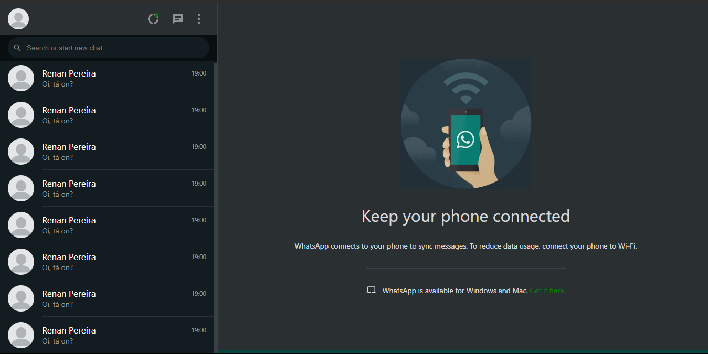

# Whatsapp Web Clone
A clone of Whatsapp Web using React.


## Technologies
* React
* React Icons
* Typescript
* styled-components

## How to run

```
# Clone repository

git clone https://github.com/r3nanp/whatsappweb-clone.git
```

```
# At the root of the project, run:

yarn
```

```
# Run app

yarn start or npm start
```

<!-- ### Link
[Website]() -->

### Screenshots
  
